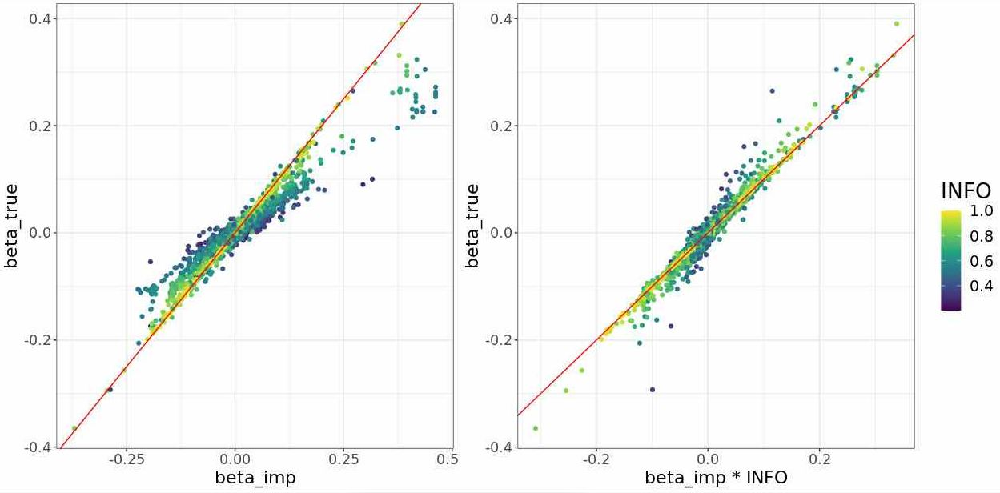

```{r setup, include=FALSE}
options(htmltools.dir.version = FALSE)
knitr::opts_chunk$set(echo = FALSE, fig.align = 'center', dev = "png")
```

class: title-slide center middle inverse

## Multiple sources of misspecification<br>in summary statistics

### Application to polygenic scores

<br>

#### Florian Privé

---

### Reminder: from marginal to joint effects

The joint effects (with an intercept) are obtained by solving
$$\boldsymbol{\hat{\gamma}_{\text{joint}}} = (\boldsymbol{G}^T \boldsymbol{C_n} \boldsymbol{G})^{-1} \boldsymbol{G}^T \boldsymbol{C_n} \boldsymbol{y} ~.$$

The marginal effects (assuming no covariate) simplify to 
$$\boldsymbol{\hat{\gamma}_{\text{marg}}} = \dfrac{1}{n-1} \boldsymbol{S}^{-2} \boldsymbol{G}^T \boldsymbol{C_n} \boldsymbol{y} ~.$$
We further note that the correlation matrix of $\boldsymbol{G}$ is $$\boldsymbol{R} =  \dfrac{1}{n-1} \boldsymbol{S}^{-1} \boldsymbol{G}^T \boldsymbol{C_n} \boldsymbol{G}  \boldsymbol{S}^{-1} ~.$$

Then we get 
$$\boldsymbol{\hat{\gamma}_{\text{joint}}} = \boldsymbol{S}^{-1} \boldsymbol{R}^{-1} \boldsymbol{S} \boldsymbol{\hat{\gamma}_{\text{marg}}} ~.$$
Where $S_{j,j} = \text{sd}(\boldsymbol{G_j}) \approx \dfrac{\text{sd}(\boldsymbol{y})}{\sqrt{n ~ \text{se}(\hat{\gamma}_j)^2 + \hat{\gamma}_j^2}}$.

---

### Quality control in LDpred2

To verify that $S_{j,j} = \text{sd}(\boldsymbol{G_j}) \approx \dfrac{\text{sd}(\boldsymbol{y})}{\sqrt{n ~ \text{se}(\hat{\gamma}_j)^2 + \hat{\gamma}_j^2}}$.

```{r, out.width="80%"}
knitr::include_graphics("figures/sd-approx-BRCA.png")
```

---

### **First misspecification**: the correlation matrix

Possible issues

1. $R$ is estimated from another dataset (not the GWAS one)

2. $R$ is made sparse (for computational reasons)

    - $R_{i,j}=0$ if variants $i$ and $j$ are more than 3cM away (still 30 GB to store for e.g. 1M HapMap3 variants)
    
    - $R_{i,j}=0$ if $R_{i,j}<0.01$? Could extend to more than 1M variants, but would increase misspecification (not SPD at all).
    
--

<br>

Possible solutions

1. Replace $R$ by $R_s = (1 - s) ~ R + s ~ I$ (lassosum) or $R_{\delta} = R + \delta ~ I$.

2. Replace $R_{i,j}$ by $R_{i,j} \cdot \exp(-2 N_e d_{i,j} / m)$ (RSS and SBayesR),
where Ne = 11400, m = 183 and $d_{i,j}$ is the distance in Morgan. This shrinkage is equal to $0.024$ for 3cM.
    
---

### **Second misspecification**: varying GWAS sample sizes

Simulating phenotypes with h2=0.2 and 2000 causal variants in chromosome 22, and performing GWAS with 
- N=300K for 50% of variants, 
- N=240K (80%) for 25%, and 
- N=180K (60%) for 25%. 

--

```{r, out.width="90%", message=FALSE, cache=TRUE}
magick::image_read_pdf("figures/simu-misN.pdf", pages = 1)
```

---

### A closer look at lassosum2

Using $R_{\delta} = R + \delta ~ I$ $=>$ elastic-net (instead of simply lasso)

```{r, out.width="93%", message=FALSE}

```

---

### A closer look at LDpred2-grid

We can actually try some very small heritability (=> strong regularization)

```{r, out.width="93%", message=FALSE}

```

---

### Imputation of N?

```{r, out.width="70%", message=FALSE, cache=TRUE}
magick::image_read_pdf("figures/simu-qc-plot.pdf", pages = 1)
```

---

### A closer look at lassosum2 (with imputed N)

<br>

```{r, out.width="93%", message=FALSE}
knitr::include_graphics("figures/lassosum2-mis-imputeN.JPG")
```

---

### A closer look at LDpred2-grid (with imputed N)

<br>

```{r, out.width="93%", message=FALSE}

```

---

### **Third misspecification**: sumstats from imputed genotypes

The standard deviations of the genotypes are smaller.

```{r, out.width="75%"}

```

---

### Simple correction for SD

<br>

```{r, out.width="80%"}

```

---

### Impact on GWAS effects

<br>

$$\boldsymbol{\hat{\gamma}_{\text{marg}}} = \dfrac{1}{n-1} \boldsymbol{S}^{-2} \boldsymbol{G}^T \boldsymbol{C_n} \boldsymbol{y} ~.$$
```{r, out.width="100%"}

```

---

### Comparison with multiple imputation

Randomly impute (according to imputation probabilities), run GWAS, repeat, average.

```{r, out.width="80%"}

```

---

### Final transformation

<br>

We are interested in $$\boldsymbol{\hat{\gamma}_{\text{joint}}} = \boldsymbol{S}^{-1} \boldsymbol{R}^{-1} \boldsymbol{S} \boldsymbol{\hat{\gamma}_{\text{marg}}} ~.$$

<br>

Then, we could probably compute instead 

$$\boldsymbol{\hat{\gamma}_{\text{joint}}} = \boldsymbol{F} \boldsymbol{S}^{-1} \boldsymbol{R}^{-1} \boldsymbol{F} \boldsymbol{S} \boldsymbol{\hat{\gamma}_{\text{marg}}} ~.$$

where $\boldsymbol{F}$ is the diagonal matrix containing $\sqrt{\text{INFO}}$.

---

### Impact of this correction for lassosum2

Simulation with 20K variants on chromosome 22, with 500 causal explaining h2=0.2.

```{r, out.width="95%"}

```

---

### **Fourth misspecification**: correlation from imputed genotypes

E.g. if using UK Biobank imputed data to compute $R$.

```{r, out.width="80%"}

```

---

### Multiple imputation to the rescue

Randomly impute (according to imputation probabilities), compute correlation, repeat, average.

```{r, out.width="80%"}

```

---

### A more direct solution

Just correct values from imputed dosages using INFO score.

```{r, out.width="85%"}

```

---

### A note on INFO scores

You need to recompute them, instead of using the ones reported.

<br>

```{r, out.width="85%"}

```

---

## Conclusion

There are many possible sources of misspecification when deriving PGS from summary statistics:

--

1. We estimate out-sample LD => need some regularization

--

2. GWAS sample size is not always the same for all variants (and this information is often missing in summary statistics)

--

3. GWAS summary statistics from imputed data need to be corrected; $\text{INFO}_j < 1$ resembles $n_j < N$, but the correction is slightly different

--

4. When computing LD from imputed data, need to correct as well

--

<br>

My hope is that correcting for N / INFO will be enough for e.g. LDpred2-auto (which cannot really play with different regularizations).

I need to test this on real data.

---

class: center middle inverse

# That's all folks!
